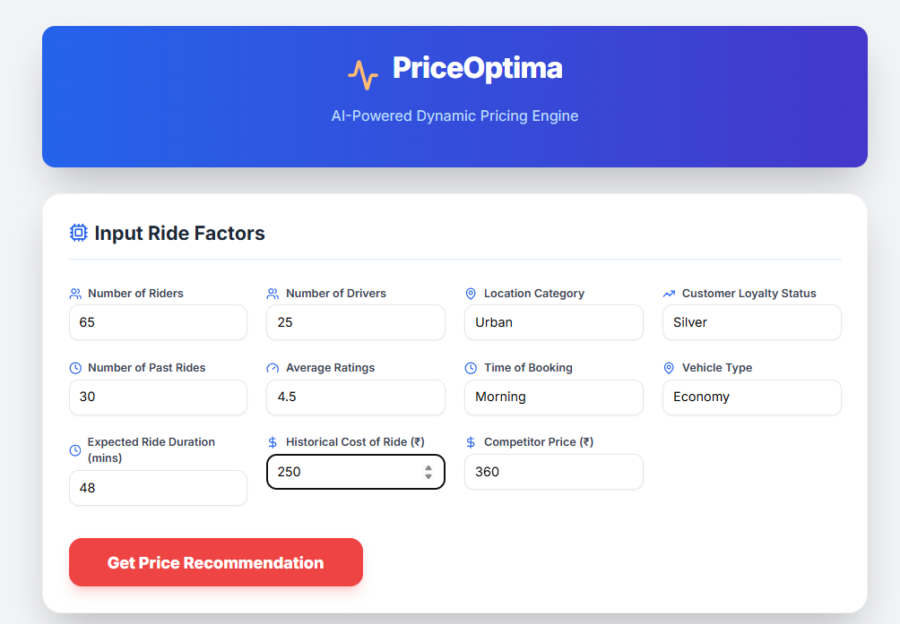

# 💰 AI PriceOptima: Dynamic Ride-Sharing Pricing Engine
## 🎯 Project Overview
AI PriceOptima is an end-to-end dynamic pricing solution designed for ride-sharing or logistics services. It uses advanced machine learning models (specifically Gradient Boosting, Random Forest, and Linear Regression) to predict the optimal ride price based on various real-time and historical factors.

The goal is to maximize key business metrics—specifically Gross Margin (GM) and the probability of Ride Completion—by providing a data-driven price recommendation for every new ride request.

### Key Components
- **Machine Learning Backend (aipriceoptima.py):** Trains and evaluates pricing models using a comprehensive dataset of ridership, driver supply, customer loyalty, and historical costs.

- **Frontend Interface (App.jsx):** A modern, responsive React application that serves as the user interface (UI) for interacting with the deployed model. It allows users to input ride factors and instantly receive a price recommendation along with supporting analytics.

- **API Endpoint (FastAPI - Inferred):** A server-side application that hosts the best-performing ML model and handles real-time prediction requests from the frontend.

## 🧠 Machine Learning Methodology
The core of PriceOptima is built on supervised learning to predict the optimal price, which is inferred by balancing revenue and completion probability.

### Features Used (11 Critical Inputs)
The model leverages the following real-time and historical features for every prediction:

~ **Supply & Demand:** Number of Riders, Number of Drivers.

~ **Geographical & Temporal:** Location Category (Urban, Sub-Urban, Rural), Time of Booking (Morning, Afternoon, Evening, Night), Expected Ride Duration.

~ **Customer Factors:** Customer Loyalty Status (Gold, Silver, Regular), Number of Past Rides, Average Ratings, Vehicle Type (Economy, Premium).

~ **Cost & Competition:** Historical Cost of Ride (₹), Competitor Price (₹).

### Model Training and Selection
The aipriceoptima.py script compares multiple regression models, confirming the best choice for production:

The Gradient Boosting Regressor was selected for production due to its superior performance, indicated by the lowest Root Mean Square Error (RMSE).

## 🚀 Frontend Features (App.jsx)
The React application is designed with a focus on user experience and clarity, featuring:

**11 Input Fields:** Simple, categorized inputs for all required features.

**Real-time Recommendations:** Displays the Optimal Recommended Price (₹), the predicted P(Completion), and the potential Gross Margin (%).

**Price Comparison Badges:** Instantly compares the recommended price against the Historical Cost and the Competitor Price, providing visual feedback (Green for advantageous, Red for cautionary).

**Analytics Dashboard:** Displays mock/simulated charts (Price Distribution and Time Series Performance) to give context on the pricing policy's effectiveness.

## 🖼️ Project Screenshots
.

   
## 🛠️ Technology Stack
Frontend: React, Tailwind CSS (for styling), Lucide (for icons), Recharts (for data visualization).
Backend: Python, scikit-learn (Model training/preprocessing), Pandas/NumPy.
API: FastAPI (Inferred).
